# 风剑任务流程

## 目录

- [任务物品](#任务物品)
- [复生之瓶](#德米提恩-复生之瓶)
- [逐风者桑德兰](#逐风者桑德兰)
- [觉醒吧，雷霆之怒！](#觉醒吧，雷霆之怒！)

## 简要说明

传说能把王子解救出来的人，将接受王子的考验和祝福。其实桑德兰的雷霆之怒。逐风者的祝福之剑

祝福的内容是：英雄，希望你有一份不悔的爱情。

# 任务物品

MC 的 4、5 号 BOSS 每个出一半的任务物品，叫：`逐风者的禁锢之颅`左半部分/右半部分（分别由 MC5 号迦顿/4 号加尔掉落）

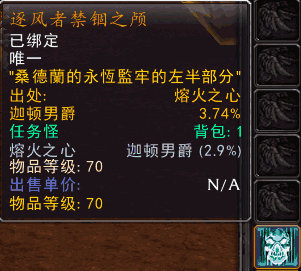
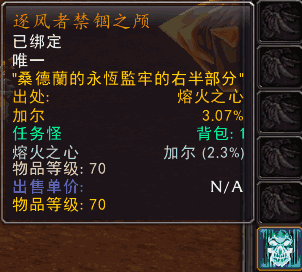

**[回到顶部](#风剑任务流程)**

# 德米提恩-复生之瓶

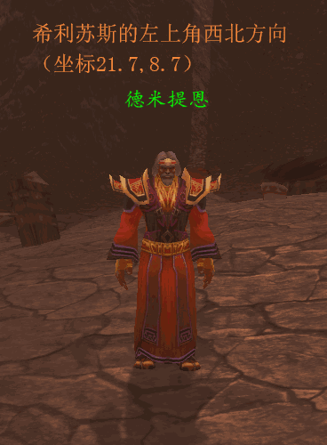
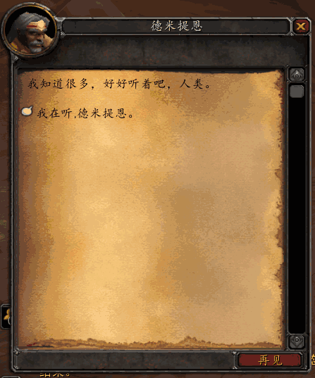
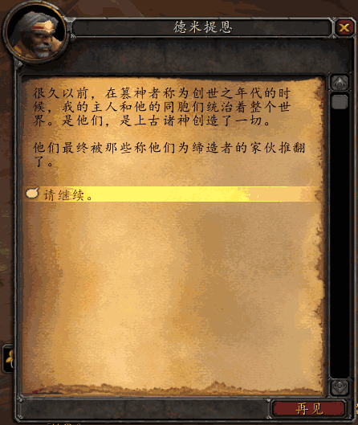
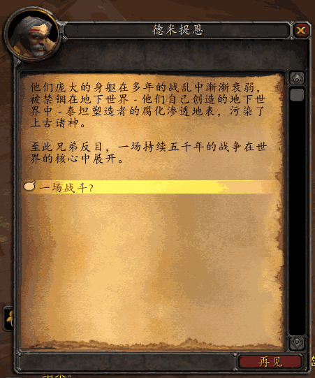
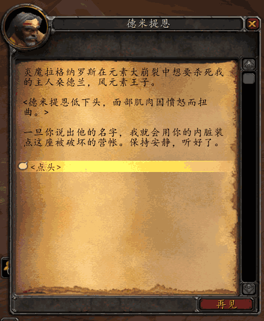
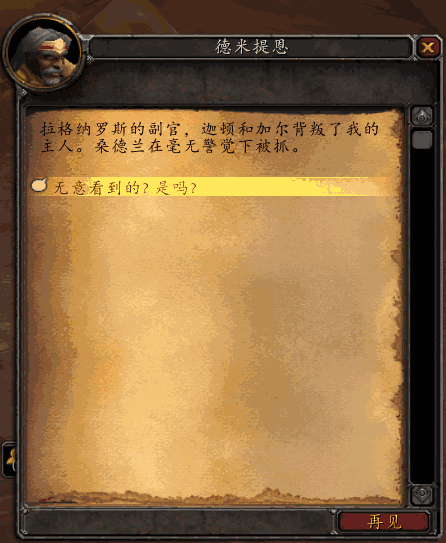
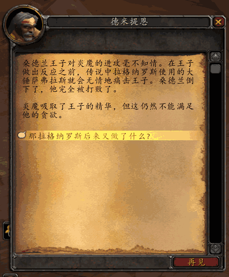
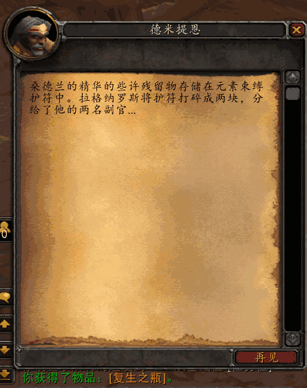
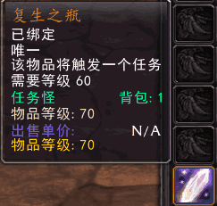
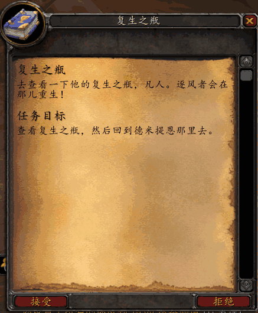
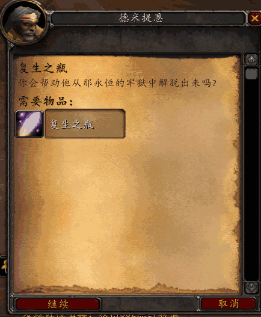
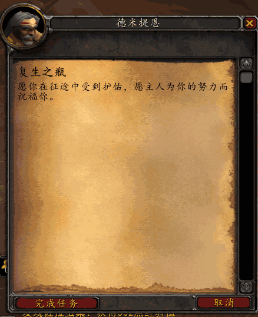

**[回到顶部](#风剑任务流程)**

# 逐风者桑德兰

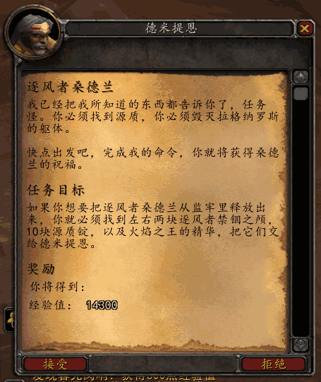
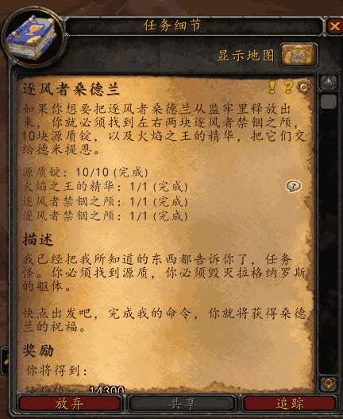
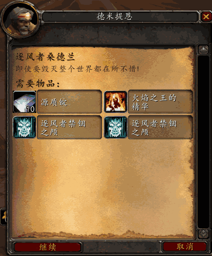

**准备完成后便可以回到德米提恩处召唤桑德兰王子**

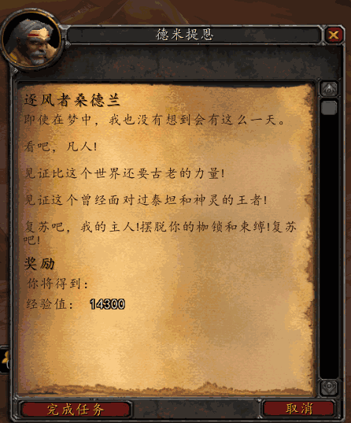

**[回到顶部](#风剑任务流程)**

# 觉醒吧，雷霆之怒！

**打败王子后可以拾取一把名为风吻之刃的剑，把它拿给德米提恩，您就可以拿到雷霆之怒·逐风者的祝福之剑**

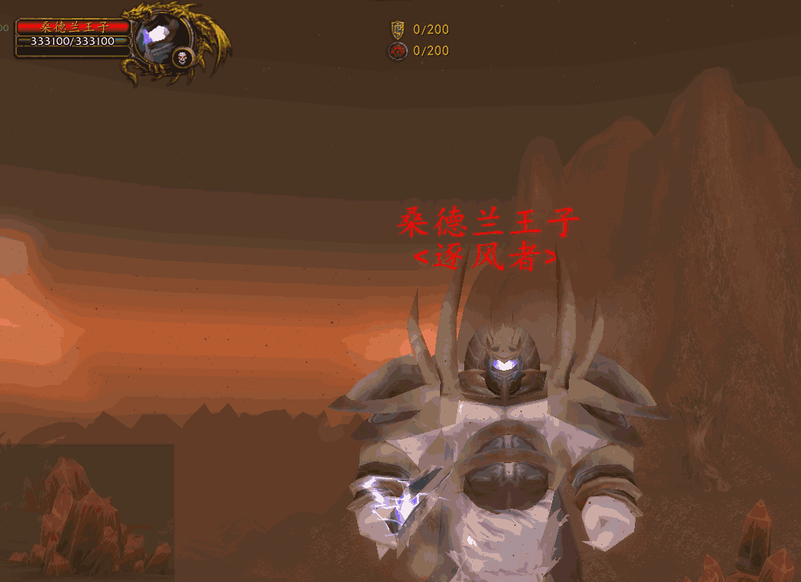
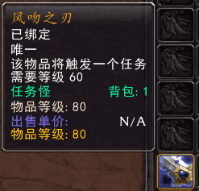
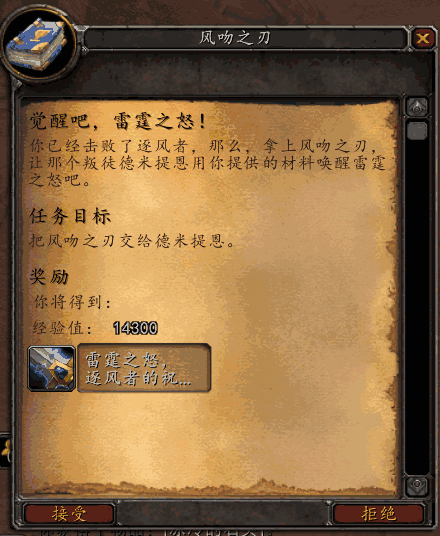
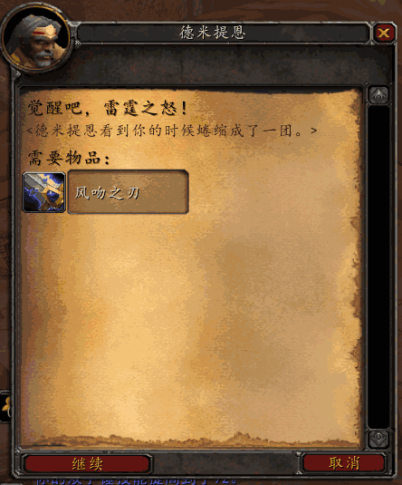
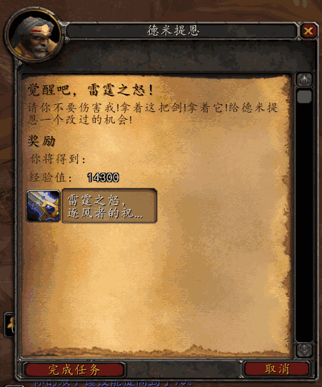
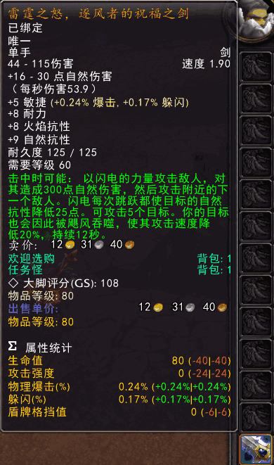
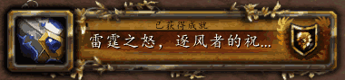

**[回到顶部](#风剑任务流程)**
